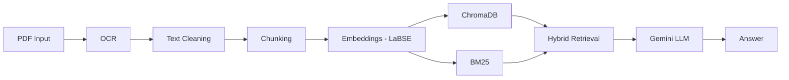

# 📚 Multilingual RAG Pipeline for Bengali PDF QA

🚀 A Retrieval-Augmented Generation (RAG) system designed to answer questions from **Bengali PDF documents**, including scanned files using OCR.

This project combines **OCR, semantic embeddings, hybrid retrieval, and LLM generation** to build an intelligent document question-answering system.

---

## 📌 Overview

This system processes Bengali PDFs (including scanned documents), extracts text using OCR, and enables users to ask questions in natural language.

It uses:
- 🔍 Semantic Search (Vector Embeddings)
- 📄 Keyword Search (BM25)
- 🤖 LLM (Google Gemini) for answer generation

---

## 🎯 Features

- 📥 Supports **scanned and text-based PDFs**
- 🔤 OCR extraction using Tesseract
- 🧠 Multilingual embeddings (LaBSE)
- 🔎 Hybrid search:
  - Vector similarity (ChromaDB)
  - BM25 keyword ranking
- 💬 Natural language question answering
- 🌐 Works with **Bengali + English queries**

---

## 🧠 Tech Stack

- Python  
- pdf2image  
- pytesseract (OCR)  
- sentence-transformers (LaBSE)  
- ChromaDB (Vector DB)  
- rank-bm25  
- LangChain  
- Google Gemini API  

---

## ⚙️ Pipeline Architecture


---

## 📂 Project Structure

- **RagPipeLine/**
  - 📓 `RagPipelineChromadb.ipynb` — Main implementation (Notebook)
  - 📁  Input PDF files
  - 📄 `README.md` — Project documentation
 
---

## ▶️ How to Run
### 1️⃣Run the project
👉 Open and run:
```bash
RagPipelineChromadb.ipynb
```
---

## 💬 Example Queries
### Example 1: English Query about a character

* **User Question:** `who is anupam?`
* **RAG System:** `Based on the provided context, Anupam is a character from the story 'Aparichita' ('অপরিচিতা গল্প'). The text also mentions Anupam's mother and uncle.`

### Example 2: Bengali Query about a character's description

* **User Question:** `অনুপমের ভাষায় কাকে সুপুরুষ বলা হয়েছে?`
* **RAG System:** `প্রদত্ত তথ্য অনুসারে, শম্ভুনাথকে সুপুরুষ বলা হয়েছে।`

### Example 3: Bengali Query about a specific relationship/role

* **User Question:** `কাকে অনুপমের ভাগ্য দেবতা বলে উল্লেখ করা হয়েছে?`
* **RAG System:** `প্রদত্ত তথ্য অনুসারে, অনুপমের মামাকে 'ভাগ্য দেবতার প্রধান এজেন্ট' বলা হয়েছে।`

---
## ⚠️ Challenges & Limitations
- OCR accuracy may vary for low-quality scans
- Bengali text preprocessing can introduce noise
- Retrieval quality depends on chunking strategy

---

## 🚀 Future Improvements
- Improve OCR accuracy with better preprocessing
- Add UI (Streamlit / Web App)
- Support multiple document uploads
- Implement evaluation metrics (accuracy, recall)
---

## 📌 Use Cases
- 📖 Educational document analysis
- 🏛️ Digital archives search
- 📑 Automated document QA systems
- 🌍 Bengali NLP applications
---

