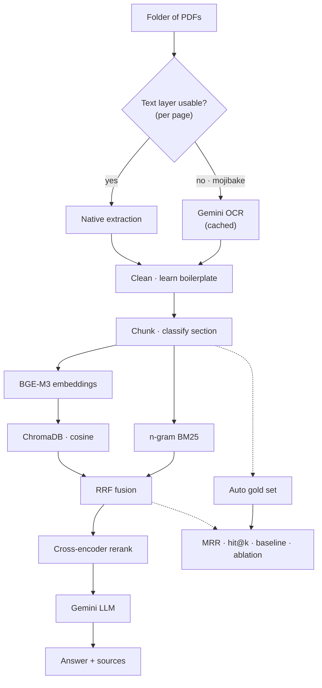

# 📚 Multilingual RAG Pipeline

A Retrieval-Augmented Generation system for question answering over **a folder of PDFs**, in **any language and any layout**. Built and measured on two deliberately different corpora: an English born-digital CV and a Bengali HSC textbook whose embedded text layer is broken.

Ask a question in Bengali about an English document, or vice versa — retrieval and answering work across the language gap.

---

## What makes this more than a tutorial

Most RAG demos work on one clean document and stop there. The hard parts show up on real files: broken PDF text layers, scripts that break naive tokenizers, near-duplicate passages that outrank the source, and metrics that quietly report success while retrieval fails.

Every default in this system was **measured, not assumed.** The evaluation harness and the decisions it drove are the point of the project.

| Decision | Evidence that drove it |
|---|---|
| OCR is decided **per page**, by script coherence | Font metadata gave false positives (base-14 fonts legitimately lack a ToUnicode map). The reliable signal is that broken Indic text is *linguistically impossible* — dependent vowel signs at word start, viramas at word end. Measured **0.00** malformed-mark ratio on valid Bengali vs **0.32–0.40** on mojibake |
| **Character n-gram** BM25 | Bengali agglutinates: `ভাগ্যদেবতার` shares *zero* whole-word tokens with a query saying `ভাগ্য দেবতা`. n-grams close the gap and are harmless for languages that don't need them |
| **Reciprocal Rank Fusion**, not a weighted score sum | Cosine similarity is bounded to [0,1]; BM25 is unbounded. Any `a·vec + b·bm25` is dominated by BM25 by construction |
| **Cosine** space with normalized vectors | ChromaDB defaults to L2, which makes `1 − distance` meaningless |
| **No section quota** | Reserving retrieval slots for "answer-bearing" sections measured **MRR 0.29 vs 0.93** without it — the quota pushed correct chunks below rank 5 |
| **Rank-sensitive metrics** (MRR, hit@1/3) | `hit@k` read 96–100% across pipeline variants whose true MRR ranged 0.22–0.93, because common answer words appear in almost any *k* chunks. hit@k alone hides everything |
| **Gold set filtered by answer frequency** | An answer occurring 100+ times in the corpus gets "hit" by luck; those questions inflate every score without measuring retrieval |

---

## Features

- **Folder ingestion** — many PDFs into one searchable index; scope a query to specific documents or search all
- **Selective OCR** — born-digital pages extract natively; only pages with a broken text layer go through OCR, cached per page
- **Broken-text-layer detection** — catches the silent failure where a PDF returns plausible-looking mojibake instead of an error
- **Learned boilerplate removal** — repeating headers/footers detected per document, no hand-written patterns
- **Content-based section tagging** — `prose` / `question` / `answer_key` / `reference`, classified by what a chunk looks like rather than by page number
- **Hybrid retrieval** — dense (BGE-M3) + sparse (n-gram BM25) fused with RRF, then a cross-encoder reranker
- **Cross-lingual QA** — Bengali questions against English text and vice versa
- **Built-in evaluation** — automatic gold-set generation, rank-sensitive metrics, a random baseline, and a one-command ablation harness
- **Provider-agnostic** — `generate` and `ocr` are plain callables; swapping LLM/OCR provider is two functions

---

## Tech stack

| Component | Choice | Why |
|---|---|---|
| PDF I/O | PyMuPDF | Renders at any DPI, exposes font metadata, no poppler dependency |
| OCR | Gemini vision (fallback) | Tesseract's Bengali model corrupts conjuncts (`শম্ভুনাথ` → `শস্তুনাথ`) |
| Embeddings | BAAI/bge-m3 | Retrieval-tuned and multilingual (LaBSE is a *bitext-mining* model — wrong objective for question→passage) |
| Reranker | BAAI/bge-reranker-v2-m3 | Cross-encoder, handles Bengali |
| Vector store | ChromaDB (cosine) | Persistent, simple |
| Lexical | rank-bm25 | With a custom n-gram tokenizer |
| Chunking | langchain-text-splitters | Punctuation-aware, incl. the Bengali danda `।` |
| LLM | Google Gemini | Generation and OCR |

---

## Architecture



---

## Project structure

```
ragkit/
├── ragkit_colab.ipynb     # runnable Colab notebook (orchestration only)
├── extract.py             # text-layer quality detection, boilerplate learning
├── sections.py            # content-based chunk classification
├── index.py               # chunking, n-gram tokenizer, hybrid retrieval
├── pipeline.py            # folder ingestion, RAG answerer
├── evaluate.py            # gold generation, rank-sensitive metrics, ablation
├── requirements.txt
└── README.md
```

The notebook only wires things together. All logic lives in the modules, so the same code deploys as a service later without change.

---

## Quick start

```python
from index import HybridIndex
from pipeline import build_corpus, RAG

index = HybridIndex(db_path="./chroma_v1", emb_cache="./emb")
build_corpus("./pdfs", index, ocr_fn=my_ocr)     # ocr_fn optional; skipped where not needed
rag = RAG(index, generate=my_llm)

rag.ask("অনুপমের ভাষায় কাকে সুপুরুষ বলা হয়েছে?")
rag.ask("What is the derivative of tan x?", docs=["lecture17_a26d54f1"])   # scope to one doc
```

`my_ocr` and `my_llm` are any callables — the notebook wires them to Gemini, but nothing depends on that.

---

## Evaluation

The evaluation tooling is the part worth reading. It answers "is retrieval actually good?" with numbers that can't lie by saturating.

```python
from evaluate import (gold_from_answer_keys, gold_from_llm,
                      filter_gold, random_baseline, evaluate, ablate)

# 1. Gold from the document's own answer keys, or LLM-generated for plain prose
gold = gold_from_answer_keys(chunks) or gold_from_llm(chunks, generate=my_llm)

# 2. Drop answers too common to require real ranking
gold = filter_gold(gold, index.corpus, max_targets=3)

# 3. Always report against chance
print("random baseline:", random_baseline(index, gold))

# 4. Retrieval + end-to-end accuracy
evaluate(index, gold, answer_fn=rag.ask)

# 5. What is each component actually worth? (retrieval-only, no API cost)
ablate(index, gold)
```

Sample ablation output on the Bengali textbook (single-target questions):

```
variant                    MRR   hit@1   hit@3   hit@k
bm25 only                0.308     12%     19%    100%
vector only              0.225      6%      6%     88%
hybrid (RRF)             0.293     12%     12%    100%
hybrid + rerank          0.313     12%     25%    100%
hybrid + rerank, no quota 0.927    88%    100%    100%   ← removing the quota was the win
```

The last row is the lesson: a hand-added constraint meant to *help* was the dominant bottleneck, invisible until the metric was made rank-sensitive.

---

## Example queries

**Bengali query, Bengali source:**
> **Q:** অনুপমের ভাষায় কাকে সুপুরুষ বলা হয়েছে?
> **A:** শম্ভুনাথকে সুপুরুষ বলা হয়েছে।

**Bengali query, English math lecture (cross-lingual):**
> **Q:** কোয়েশেন্ট রুল কী?
> **A:** কোয়েশেন্ট রুল হলো একটি ডিফারেন্সিয়েশন নিয়ম, h(x) = f(x)/g(x) আকারের ফাংশনের ডেরিভেটিভ নির্ণয়ে ব্যবহৃত: h'(x) = (g(x)f'(x) − f(x)g'(x)) / (g(x))²।

**English query, Bengali source:**
> **Q:** Who is called a good match (সৎপাত্র)?
> **A:** Anupam — the narrator refers to himself as a সৎপাত্র.

---

## What the evaluation exposed

A record of failures the metrics caught, kept because the debugging story is the substance:

- **Silent data loss.** An early cleaning regex used `[^\u0980-\u09FF]`, which deletes `।` (U+0964, in the *Devanagari* block, not Bengali) — wiping every sentence boundary before chunking.
- **Saturated metric.** hit@8 stayed 96–100% across every configuration because answer words like `মামা` occur 149 times in the corpus. The pipeline looked solved while retrieval ranking was at chance.
- **Wrong-neighbour answers.** A tokenizer treating `ভাগ্যদেবতার` as one token shared no terms with the query `ভাগ্য দেবতা`, so the model grabbed the nearest *other* name.
- **A helpful constraint that hurt.** The section quota fixed one visible failure and silently caused a larger one — MRR 0.29 vs 0.93 — found only on a rank-sensitive metric over a filtered gold set.

---

## Limitations

- **Math/formula PDFs.** Native extraction linearizes equations (`x²` → `x2`, fractions flattened). Retrieval on heavily mathematical text is weaker; routing such pages through OCR with a LaTeX-preserving prompt is future work.
- **Table layout.** Complex multi-column tables may interleave on extraction; the section classifier tags them `reference` but cell structure isn't fully preserved.
- **Section tagging is heuristic.** Tuned for structured exam material. On continuous prose it correctly abstains to `prose`; on dense LaTeX it can over-tag, though this only matters if you filter on sections.
- **OCR cost.** Gemini OCR is a network call per page. Cached, but the first pass on a large scanned document takes time.

---

## Roadmap

- Math-aware extraction path (formula-density routing → LaTeX OCR)
- Streamlit / web UI over the existing `RAG.ask(..., return_sources=True)`
- Table-structure-preserving extraction
- Answer-level confidence from reranker scores and retrieval margin

---

## Use cases

Educational document QA · digitized-archive search · exam-prep tools · low-resource-language NLP (Bengali and beyond).

---

## Acknowledgements

Embeddings and reranking by [BAAI](https://huggingface.co/BAAI). Generation and OCR by Google Gemini. Vector storage by [Chroma](https://www.trychroma.com/).